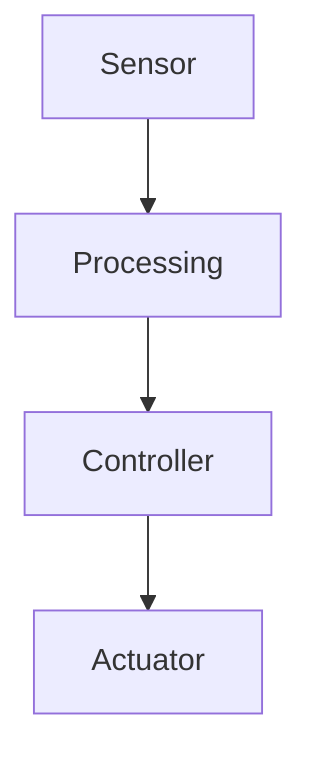

# Software Architecture

High-level software design:
- Modules and responsibilities
- Data flow
- State machines / control loops
- Threads/processes and timing

Diagrams (optional):

```mermaid
flowchart TD
  S[Sensor] --> P[Processing] --> C[Controller] --> A[Actuator]
```